# Sequence Diagrams — CodeAI Learning Platform

Interaction and intervention flows for the CodeAI platform. These reflect the
settled architecture:

- **Student view is multi-agent.**
  - **Active Agent** — the only student-facing voice. Hints/popups, answers,
    points to the front-end, walks through solutions. Delegates code generation
    to a separate **Codegen Model** (a tool), and routes prompts through
    verification first.
  - **Passive Agent** — background evaluator. Never talks to the student. Emits
    control signals to the Active Agent (slow down, speed up, reiterate, escalate)
    and raises flags to the teacher. Runs **event-driven + periodic checkpoint**.
- **Teacher view has no agents** — it is a read/control surface over the data the
  agents produce, plus human-in-the-loop routing.
- **Safety, validation, routing, and fallback are first-class.** Content safety
  filtering runs on student input and model output; a validation service scores
  submissions against a rubric; routing draws only from human-approved
  trajectories; and any failure falls back to a working non-adaptive path.

Participants used across diagrams:

- `Student`, `UI` (student IDE/front-end)
- `Active` (Active Agent), `Verifier` (prompt verification, part of Active),
  `Codegen` (code-generation model/tool)
- `Passive` (Passive Agent), `Skill` (skill-score/remediation store)
- `Teacher`, `TeacherUI`, `API`, `DB`
- `Safety` (content safety filter), `Validation` (validation service),
  `Routing` (routing service), `Content` (human-approved content store)

---

## 1. Login and role routing

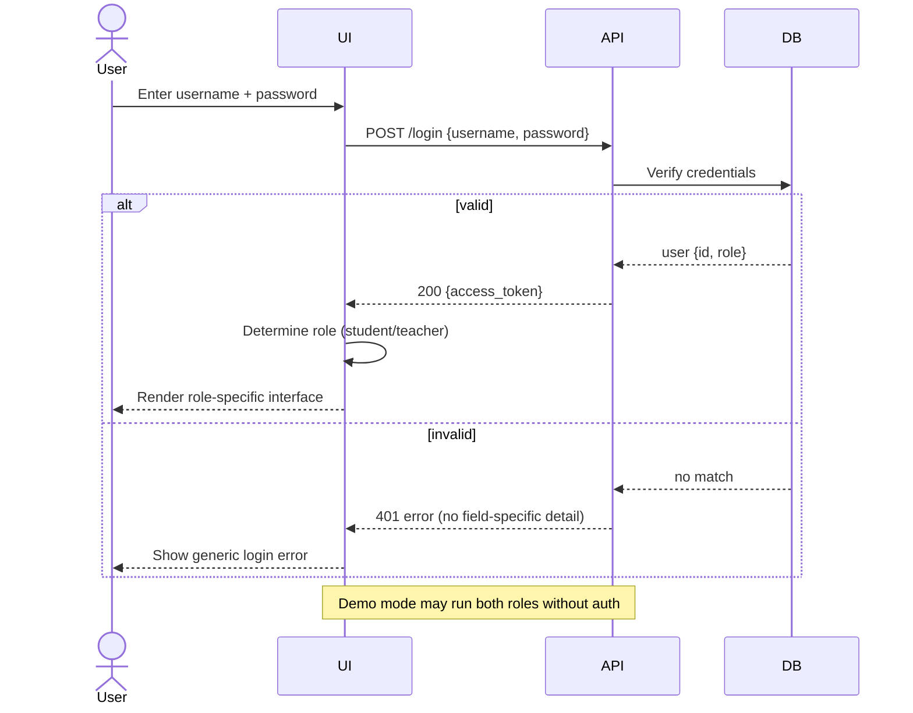
```mermaid
sequenceDiagram
    actor User
    participant UI
    participant API
    participant DB
    User->>UI: Enter username + password
    UI->>API: POST /login {username, password}
    API->>DB: Verify credentials
    alt valid
        DB-->>API: user {id, role}
        API-->>UI: 200 {access_token}
        UI->>UI: Determine role (student/teacher)
        UI-->>User: Render role-specific interface
    else invalid
        DB-->>API: no match
        API-->>UI: 401 error (no field-specific detail)
        UI-->>User: Show generic login error
    end
    Note over UI,API: Demo mode may run both roles without auth
```

## 2. Student homepage and skill tree

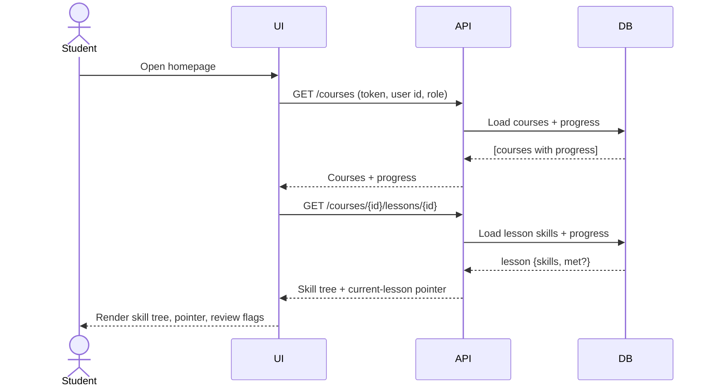
```mermaid
sequenceDiagram
    actor Student
    participant UI
    participant API
    participant DB
    Student->>UI: Open homepage
    UI->>API: GET /courses (token, user id, role)
    API->>DB: Load courses + progress
    DB-->>API: [courses with progress]
    API-->>UI: Courses + progress
    UI->>API: GET /courses/{id}/lessons/{id}
    API->>DB: Load lesson skills + progress
    DB-->>API: lesson {skills, met?}
    API-->>UI: Skill tree + current-lesson pointer
    UI-->>Student: Render skill tree, pointer, review flags
```

## 3. Formative placement and background assessment

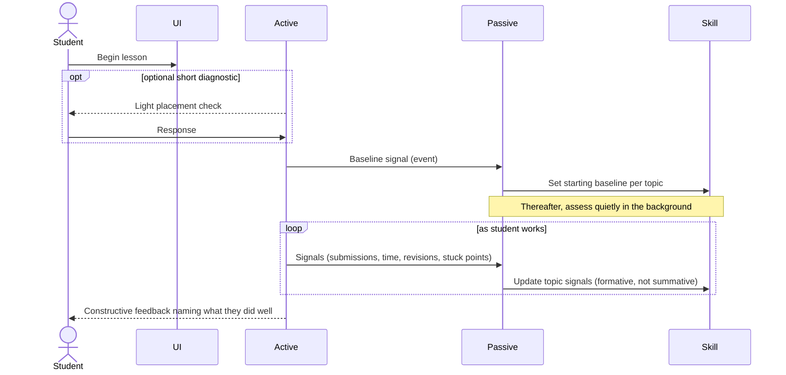
```mermaid
sequenceDiagram
    actor Student
    participant UI
    participant Active
    participant Passive
    participant Skill
    Student->>UI: Begin lesson
    opt optional short diagnostic
        Active-->>Student: Light placement check
        Student->>Active: Response
    end
    Active->>Passive: Baseline signal (event)
    Passive->>Skill: Set starting baseline per topic
    Note over Passive,Skill: Thereafter, assess quietly in the background
    loop as student works
        Active->>Passive: Signals (submissions, time, revisions, stuck points)
        Passive->>Skill: Update topic signals (formative, not summative)
    end
    Active-->>Student: Constructive feedback naming what they did well
```

## 4. Build loop with live preview

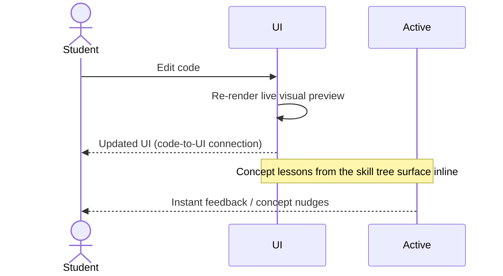
```mermaid
sequenceDiagram
    actor Student
    participant UI
    participant Active
    Student->>UI: Edit code
    UI->>UI: Re-render live visual preview
    UI-->>Student: Updated UI (code-to-UI connection)
    Note over UI,Active: Concept lessons from the skill tree surface inline
    Active-->>Student: Instant feedback / concept nudges
```

## 5. Prompt coaching and delegated code generation

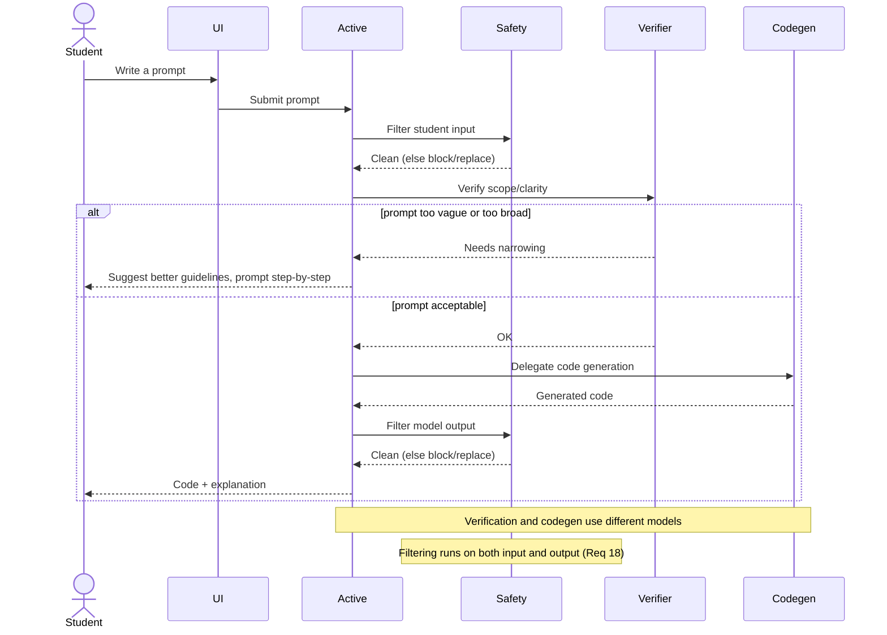
```mermaid
sequenceDiagram
    actor Student
    participant UI
    participant Active
    participant Safety
    participant Verifier
    participant Codegen
    Student->>UI: Write a prompt
    UI->>Active: Submit prompt
    Active->>Safety: Filter student input
    Safety-->>Active: Clean (else block/replace)
    Active->>Verifier: Verify scope/clarity
    alt prompt too vague or too broad
        Verifier-->>Active: Needs narrowing
        Active-->>Student: Suggest better guidelines, prompt step-by-step
    else prompt acceptable
        Verifier-->>Active: OK
        Active->>Codegen: Delegate code generation
        Codegen-->>Active: Generated code
        Active->>Safety: Filter model output
        Safety-->>Active: Clean (else block/replace)
        Active-->>Student: Code + explanation
    end
    Note over Active,Codegen: Verification and codegen use different models
    Note over Safety: Filtering runs on both input and output (Req 18)
```

## 6. Run, error detection, and skill-aware hints

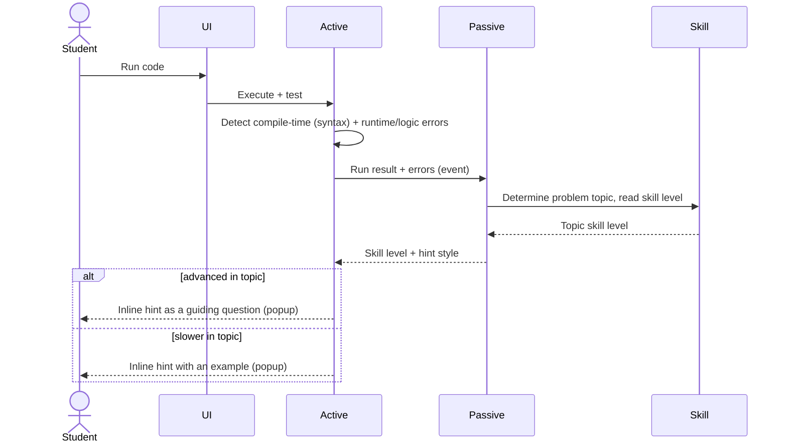
```mermaid
sequenceDiagram
    actor Student
    participant UI
    participant Active
    participant Passive
    participant Skill
    Student->>UI: Run code
    UI->>Active: Execute + test
    Active->>Active: Detect compile-time (syntax) + runtime/logic errors
    Active->>Passive: Run result + errors (event)
    Passive->>Skill: Determine problem topic, read skill level
    Skill-->>Passive: Topic skill level
    Passive-->>Active: Skill level + hint style
    alt advanced in topic
        Active-->>Student: Inline hint as a guiding question (popup)
    else slower in topic
        Active-->>Student: Inline hint with an example (popup)
    end
```

## 7. Skill-score update and remediation trigger

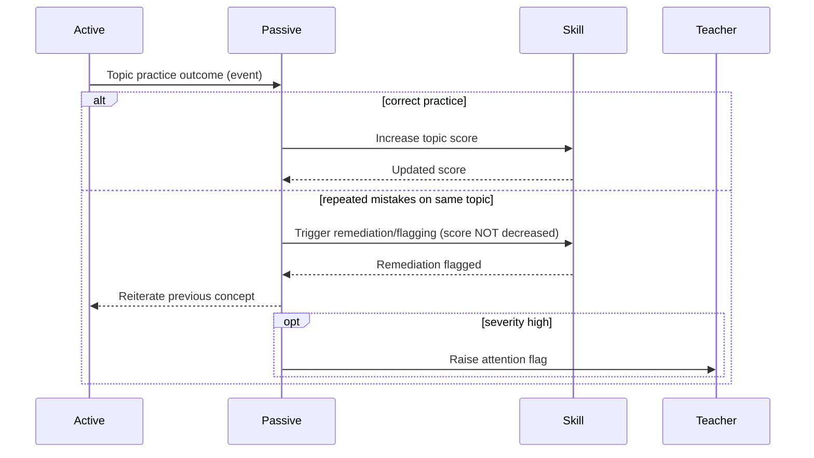
```mermaid
sequenceDiagram
    participant Active
    participant Passive
    participant Skill
    participant Teacher
    Active->>Passive: Topic practice outcome (event)
    alt correct practice
        Passive->>Skill: Increase topic score
        Skill-->>Passive: Updated score
    else repeated mistakes on same topic
        Passive->>Skill: Trigger remediation/flagging (score NOT decreased)
        Skill-->>Passive: Remediation flagged
        Passive-->>Active: Reiterate previous concept
        opt severity high
            Passive->>Teacher: Raise attention flag
        end
    end
```

## 8. Passive intervention — adaptive pacing

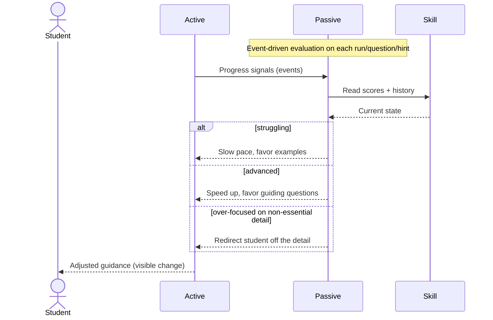
```mermaid
sequenceDiagram
    actor Student
    participant Active
    participant Passive
    participant Skill
    Note over Passive: Event-driven evaluation on each run/question/hint
    Active->>Passive: Progress signals (events)
    Passive->>Skill: Read scores + history
    Skill-->>Passive: Current state
    alt struggling
        Passive-->>Active: Slow pace, favor examples
    else advanced
        Passive-->>Active: Speed up, favor guiding questions
    else over-focused on non-essential detail
        Passive-->>Active: Redirect student off the detail
    end
    Active-->>Student: Adjusted guidance (visible change)
```

## 9. Passive intervention — periodic checkpoint

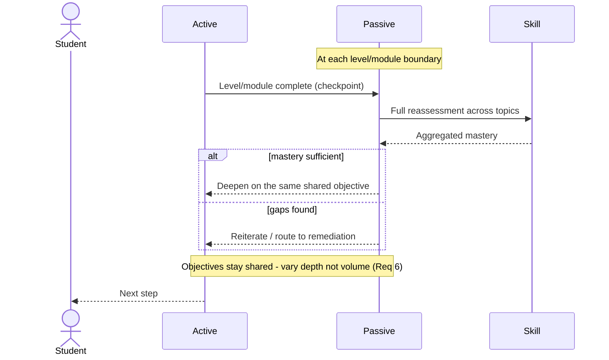
```mermaid
sequenceDiagram
    actor Student
    participant Active
    participant Passive
    participant Skill
    Note over Passive: At each level/module boundary
    Active->>Passive: Level/module complete (checkpoint)
    Passive->>Skill: Full reassessment across topics
    Skill-->>Passive: Aggregated mastery
    alt mastery sufficient
        Passive-->>Active: Deepen on the same shared objective
    else gaps found
        Passive-->>Active: Reiterate / route to remediation
    end
    Note over Passive,Active: Objectives stay shared - vary depth not volume (Req 6)
    Active-->>Student: Next step
```

## 10. Scaffolded help ladder with timed answer reveal

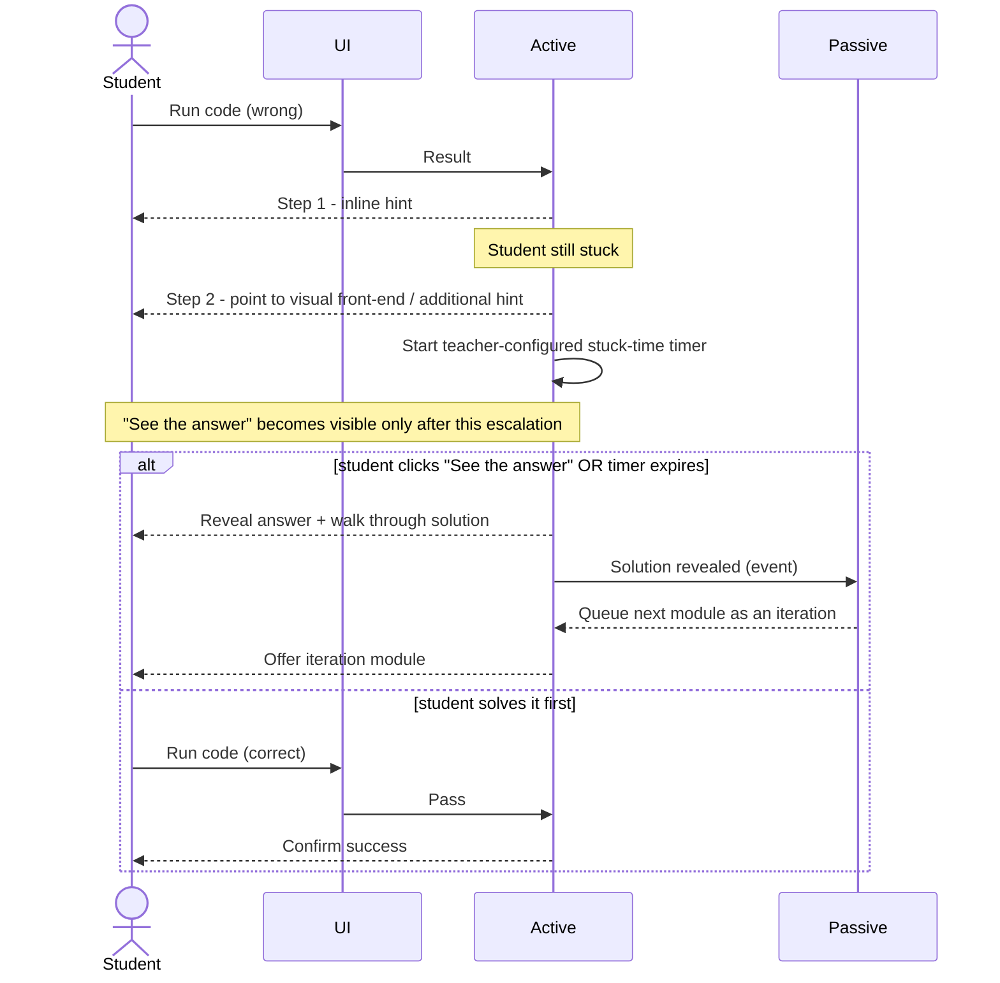
```mermaid
sequenceDiagram
    actor Student
    participant UI
    participant Active
    participant Passive
    Student->>UI: Run code (wrong)
    UI->>Active: Result
    Active-->>Student: Step 1 - inline hint
    Note over Active: Student still stuck
    Active-->>Student: Step 2 - point to visual front-end / additional hint
    Active->>Active: Start teacher-configured stuck-time timer
    Note over Active,Student: "See the answer" becomes visible only after this escalation
    alt student clicks "See the answer" OR timer expires
        Active-->>Student: Reveal answer + walk through solution
        Active->>Passive: Solution revealed (event)
        Passive-->>Active: Queue next module as an iteration
        Active-->>Student: Offer iteration module
    else student solves it first
        Student->>UI: Run code (correct)
        UI->>Active: Pass
        Active-->>Student: Confirm success
    end
```

## 11. Escalation to teacher (async + optional real-time)

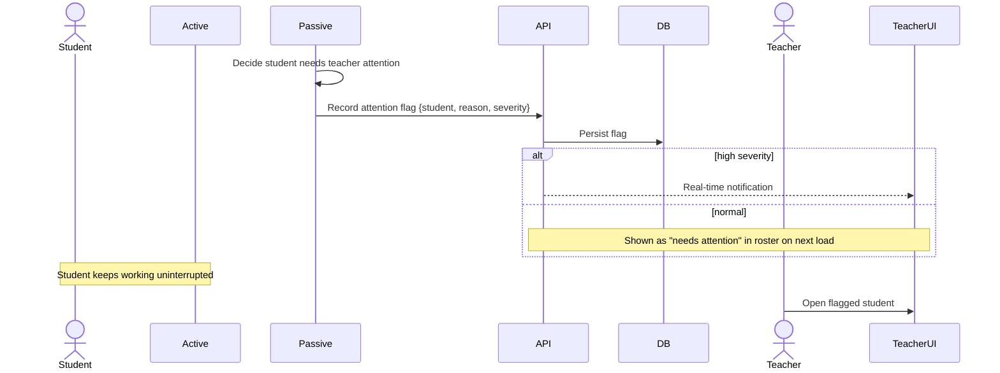
```mermaid
sequenceDiagram
    actor Student
    participant Active
    participant Passive
    participant API
    participant DB
    actor Teacher
    participant TeacherUI
    Passive->>Passive: Decide student needs teacher attention
    Passive->>API: Record attention flag {student, reason, severity}
    API->>DB: Persist flag
    alt high severity
        API-->>TeacherUI: Real-time notification
    else normal
        Note over API,TeacherUI: Shown as "needs attention" in roster on next load
    end
    Note over Student,Active: Student keeps working uninterrupted
    Teacher->>TeacherUI: Open flagged student
```

## 12. Teacher review of student (double-click, no agents)

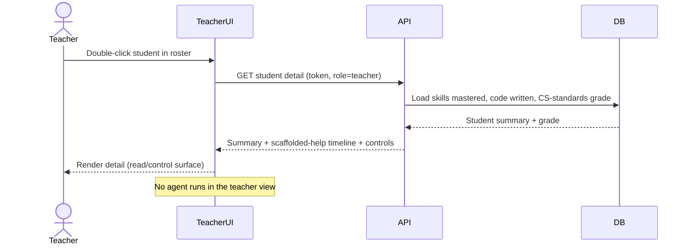
```mermaid
sequenceDiagram
    actor Teacher
    participant TeacherUI
    participant API
    participant DB
    Teacher->>TeacherUI: Double-click student in roster
    TeacherUI->>API: GET student detail (token, role=teacher)
    API->>DB: Load skills mastered, code written, CS-standards grade
    DB-->>API: Student summary + grade
    API-->>TeacherUI: Summary + scaffolded-help timeline + controls
    TeacherUI-->>Teacher: Render detail (read/control surface)
    Note over TeacherUI: No agent runs in the teacher view
```

## 13. Teacher controls over the help ladder

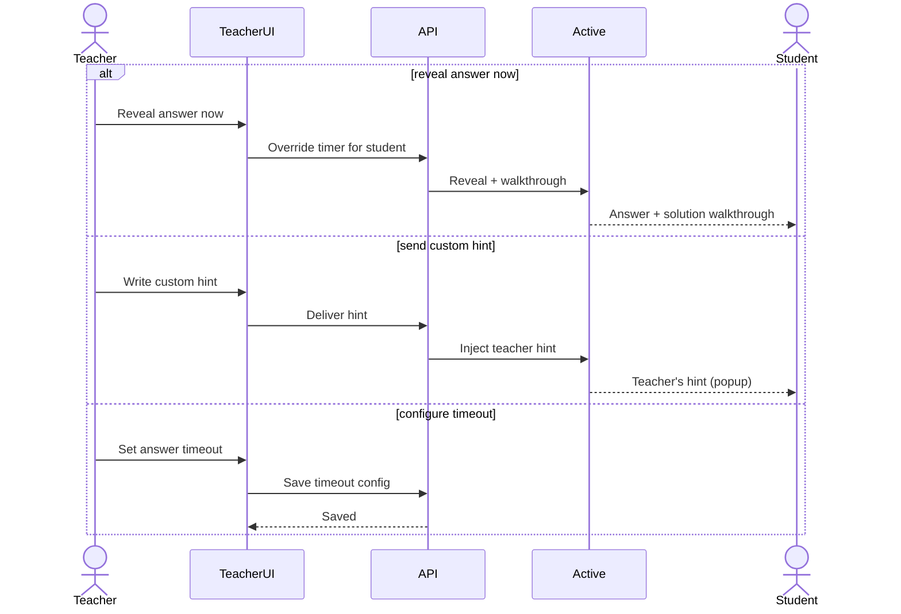
```mermaid
sequenceDiagram
    actor Teacher
    participant TeacherUI
    participant API
    participant Active
    actor Student
    alt reveal answer now
        Teacher->>TeacherUI: Reveal answer now
        TeacherUI->>API: Override timer for student
        API->>Active: Reveal + walkthrough
        Active-->>Student: Answer + solution walkthrough
    else send custom hint
        Teacher->>TeacherUI: Write custom hint
        TeacherUI->>API: Deliver hint
        API->>Active: Inject teacher hint
        Active-->>Student: Teacher's hint (popup)
    else configure timeout
        Teacher->>TeacherUI: Set answer timeout
        TeacherUI->>API: Save timeout config
        API-->>TeacherUI: Saved
    end
```

## 14. Human-in-the-loop routing with CS-standards grade

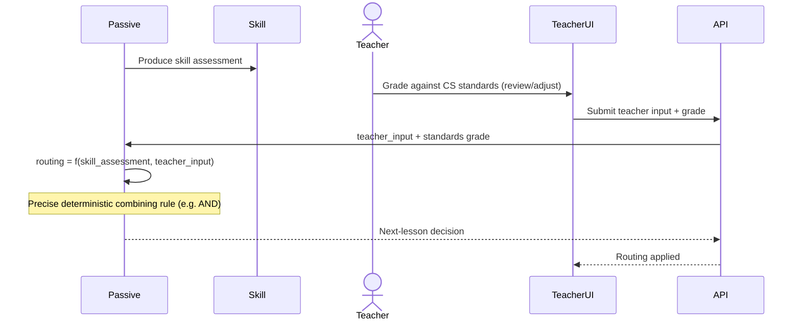
```mermaid
sequenceDiagram
    participant Passive
    participant Skill
    actor Teacher
    participant TeacherUI
    participant API
    Passive->>Skill: Produce skill assessment
    Teacher->>TeacherUI: Grade against CS standards (review/adjust)
    TeacherUI->>API: Submit teacher input + grade
    API->>Passive: teacher_input + standards grade
    Passive->>Passive: routing = f(skill_assessment, teacher_input)
    Note over Passive: Precise deterministic combining rule (e.g. AND)
    Passive-->>API: Next-lesson decision
    API-->>TeacherUI: Routing applied
```

## 15. Content safety filtering (input and output)

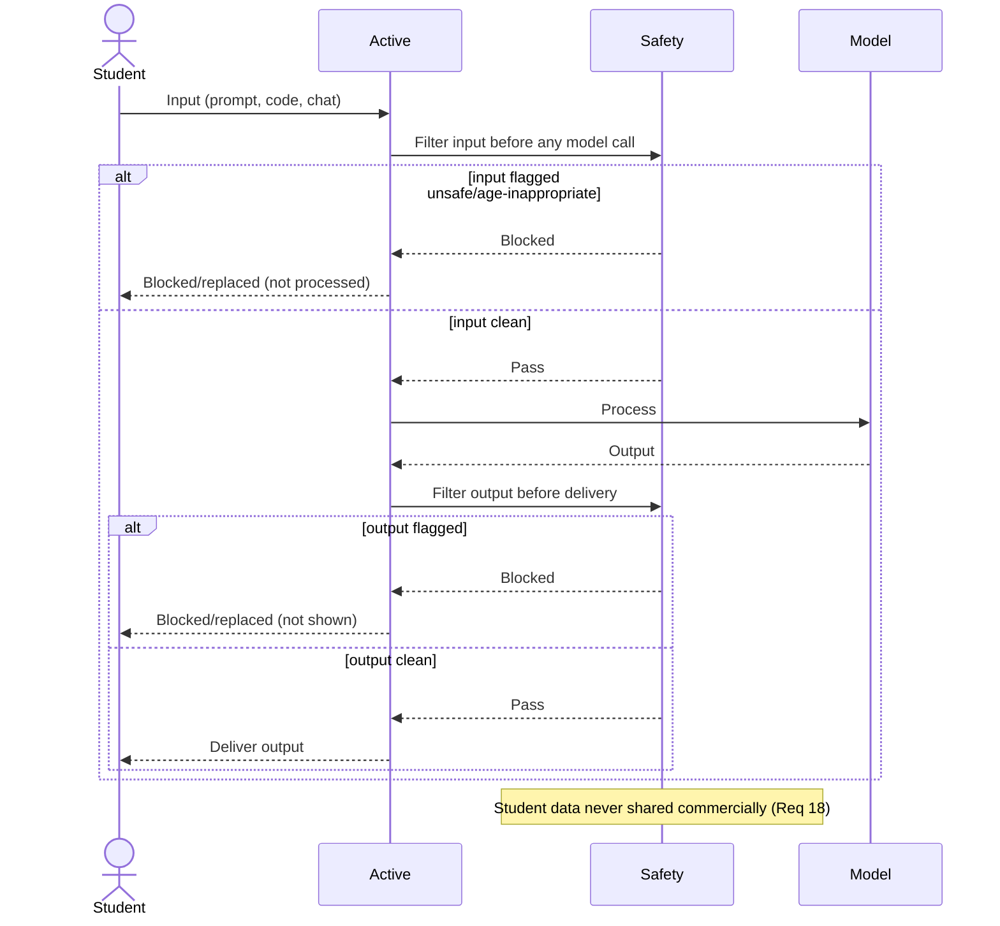
```mermaid
sequenceDiagram
    actor Student
    participant Active
    participant Safety
    participant Model
    Student->>Active: Input (prompt, code, chat)
    Active->>Safety: Filter input before any model call
    alt input flagged unsafe/age-inappropriate
        Safety-->>Active: Blocked
        Active-->>Student: Blocked/replaced (not processed)
    else input clean
        Safety-->>Active: Pass
        Active->>Model: Process
        Model-->>Active: Output
        Active->>Safety: Filter output before delivery
        alt output flagged
            Safety-->>Active: Blocked
            Active-->>Student: Blocked/replaced (not shown)
        else output clean
            Safety-->>Active: Pass
            Active-->>Student: Deliver output
        end
    end
    Note over Safety: Student data never shared commercially (Req 18)
```

## 16. Validation service and mastery signal

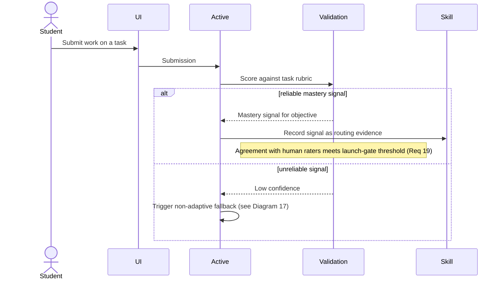
```mermaid
sequenceDiagram
    actor Student
    participant UI
    participant Active
    participant Validation
    participant Skill
    Student->>UI: Submit work on a task
    UI->>Active: Submission
    Active->>Validation: Score against task rubric
    alt reliable mastery signal
        Validation-->>Active: Mastery signal for objective
        Active->>Skill: Record signal as routing evidence
        Note over Validation: Agreement with human raters meets launch-gate threshold (Req 19)
    else unreliable signal
        Validation-->>Active: Low confidence
        Active->>Active: Trigger non-adaptive fallback (see Diagram 17)
    end
```

## 17. Non-adaptive fallback path

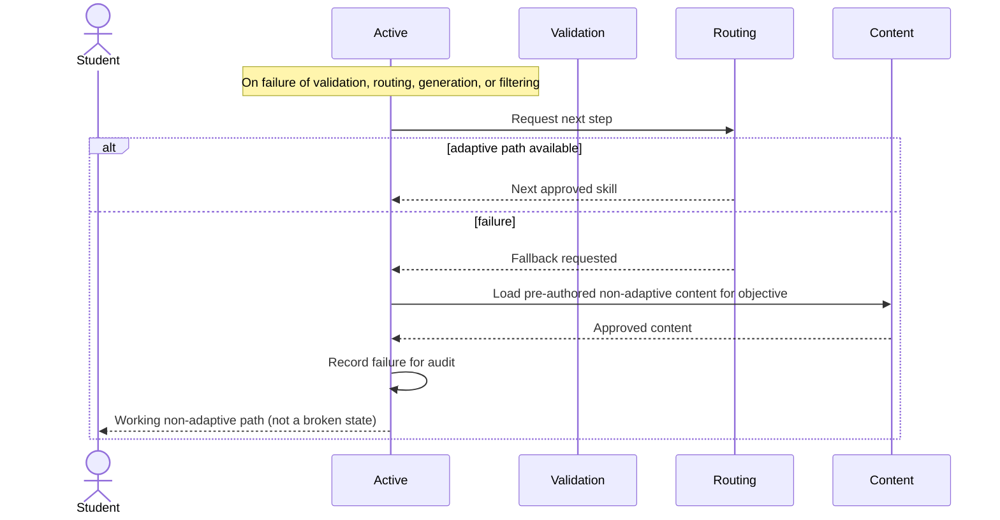
```mermaid
sequenceDiagram
    actor Student
    participant Active
    participant Validation
    participant Routing
    participant Content
    Note over Active: On failure of validation, routing, generation, or filtering
    Active->>Routing: Request next step
    alt adaptive path available
        Routing-->>Active: Next approved skill
    else failure
        Routing-->>Active: Fallback requested
        Active->>Content: Load pre-authored non-adaptive content for objective
        Content-->>Active: Approved content
        Active->>Active: Record failure for audit
        Active-->>Student: Working non-adaptive path (not a broken state)
    end
```

## 18. Approved-trajectory routing with quality and safety gates

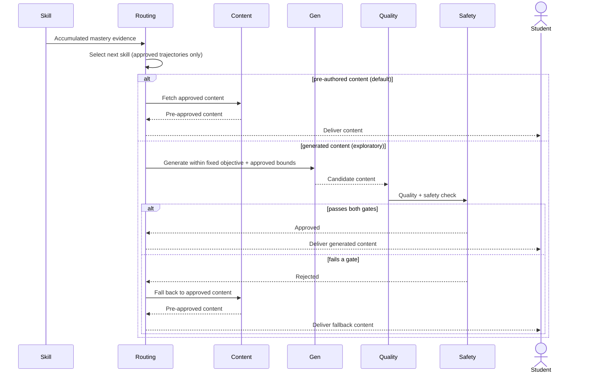
```mermaid
sequenceDiagram
    participant Skill
    participant Routing
    participant Content
    participant Gen
    participant Quality
    participant Safety
    actor Student
    Skill->>Routing: Accumulated mastery evidence
    Routing->>Routing: Select next skill (approved trajectories only)
    alt pre-authored content (default)
        Routing->>Content: Fetch approved content
        Content-->>Routing: Pre-approved content
        Routing-->>Student: Deliver content
    else generated content (exploratory)
        Routing->>Gen: Generate within fixed objective + approved bounds
        Gen-->>Quality: Candidate content
        Quality->>Safety: Quality + safety check
        alt passes both gates
            Safety-->>Routing: Approved
            Routing-->>Student: Deliver generated content
        else fails a gate
            Safety-->>Routing: Rejected
            Routing->>Content: Fall back to approved content
            Content-->>Routing: Pre-approved content
            Routing-->>Student: Deliver fallback content
        end
    end
```

## Coverage map

| Diagram | Requirement(s) |
| --- | --- |
| 1 Login and role routing | 1 |
| 2 Homepage and skill tree | 2 |
| 3 Formative placement + background assessment | 3 |
| 4 Build loop with live preview | 4 |
| 5 Prompt coaching + delegated codegen | 7 |
| 6 Run, error detection, skill-aware hints | 4, 5 |
| 7 Skill-score update and remediation | 6 |
| 8 Passive intervention — adaptive pacing | 5 |
| 9 Passive intervention — periodic checkpoint | 5, 6 |
| 10 Scaffolded help ladder + timed reveal | 10 |
| 11 Escalation to teacher | 5, 8 |
| 12 Teacher review of student | 9 |
| 13 Teacher controls over help ladder | 10 |
| 14 Human-in-the-loop routing | 8, 9 |
| 15 Content safety filtering | 18 |
| 16 Validation service + mastery signal | 19 |
| 17 Non-adaptive fallback path | 20 |
| 18 Approved-trajectory routing + gates | 21 |
